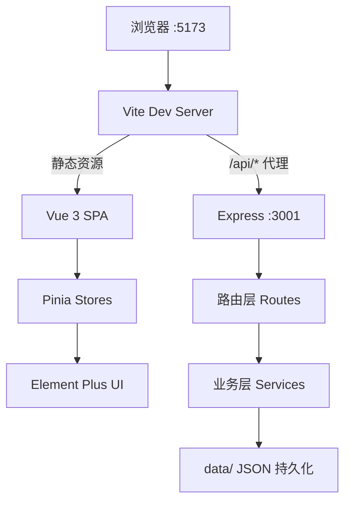

# Thought Draft — 基于个人Obsidian 知识库的灵感助手

基于 **Vue 3 Composition API + Element Plus + Pinia**（前端）与 **Node.js Express + TypeScript**（后端）的独立全栈，基于个人Obsidian 知识库的灵感助手。前后端解耦部署，通过 REST API / SSE 通信。

## 为什么想做这个？
我在前段时间入坑了**Obsidian**,把课程笔记和小米备忘录的近2k+条随笔杂记也转移到了obsidian,并且将其分为了三个库：

**1.学习知识库** 用于存档我的各学科的学习笔记，记录我学习了什么

**2.个人随笔库** 记录了我大量的杂思和随笔，我是怎样的一个人

**3.博客库** 是我准备对外发布到个人博客/个人公众号的预备稿件，这些是面向外界的

我在想，学习笔记和杂思随笔，其实也是可以构造关联的，在写作或者思考的时候，能不能基于我的Obsidian wiki去做一些有意思联系和给我一些灵感呢，我想到的是这三个方面：

**1.头脑风暴** 输入最近想探讨，有感悟的主题，可以检索你指定的某一个知识库/全部库来检索出top30最相关的主题，并且建立起围绕探讨主题的关联

**2.写作助手** 与头脑风暴不同，直接针对探讨主题和相关内容来输出完整的文章，并且文章中提及的存在obsidian里的markdown文档链接也会给出来，可以点击一键跳转进入obsidian页面，最终生成的结果也可以一键写入到博客库的草稿draft文件夹中，导入时可以选择tags或者指定的路径

**3.连接发现** 直接把围绕这个主题相关的笔记链接给出写入双链的推荐，点击“写入”则自动在obsidian里创立链接

三者在输入一个探讨主题之后同步输出，点击不同的名称按钮就可以切换不同的路由页面

以上，我打造了这个项目obsidian-thought-draft，跑通了前后端与LLM对接的流程，也熟悉了轻量级RAG的实现链路。

## 运行示例
### 1.选择个人随笔库为示例，页面颜色有两种选择，这里选择Monet主题
探讨主题：如何活出绚烂的一生？


点击发送，会弹出选择框，你可以叉掉你觉得不那么适合的笔记


确认后，会根据这些之中的top15条来完成输出
#### 头脑风暴页面


#### 写作助手页面 （节选）


可以按导出到博客库里，可以自己去更改标签和分类


选择复制公众号，直接就是微信公众号的格式可以去粘贴

#### 链接发现 （节选）
点击写入，可以自动在obsidian里建立好链接


## 架构



两进程独立运行，Vite 通过 `server.proxy` 将 `/api/*` 转发到 Express：

```
浏览器 :5173  →  Vite Dev Server  →  /api/*  →  Express :3001
```

### 模块边界

| 层     | 位置                     | 技术                    | 职责                                           |
| ------ | ------------------------ | ----------------------- | ---------------------------------------------- |
| 视图层 | `src/components/`      | Vue 3 SFC, Element Plus | 聊天面板、知识库侧边栏、会话列表、导出弹窗     |
| 状态层 | `src/stores/`          | Pinia                   | 按 domain 拆分：chat / vault / session / theme |
| 编排层 | `src/composables/`     | Vue Composition API     | useSSE、useExport、useObsidianUri              |
| API 层 | `server/src/routes/`   | Express Router          | RESTful 路由、参数校验、SSE 推送               |
| 领域层 | `server/src/services/` | TypeScript 纯函数       | BM25 检索、vault 扫描、Prompt 构建、博客配置   |
| 数据层 | `data/`                | JSON 文件               | 会话、知识库索引、vault 配置持久化             |

### 关键技术决策

| 决策       | 选型                     | 理由                                                             |
| ---------- | ------------------------ | ---------------------------------------------------------------- |
| 前端框架   | Vue 3 + Composition API  | 组件化、响应式、TypeScript 原生支持                              |
| UI 库      | Element Plus             | 成熟的企业级 Vue 3 组件库                                        |
| 状态管理   | Pinia                    | Vue 3 官方推荐，按 domain 拆分无循环依赖                         |
| 后端框架   | Express                  | 路由直观、中间件生态成熟、面试可讲清 REST + 中间件分层           |
| 后端运行时 | tsx（开发）/ tsc（构建） | TypeScript 类型安全，前后端共享类型定义                          |
| SSE 流式   | Express `res.write()`  | 标准 Web API，前端 `ReadableStream` + `getReader()` 逐字消费 |
| Markdown   | Marked（前后端复用）     | 同一个解析器，输出一致                                           |
| 全文检索   | MiniSearch（BM25）       | 轻量级本地索引，无需外部搜索引擎                                 |
| 样式       | Sass + CSS 变量          | 双主题（Monet / Noir）通过 CSS 变量切换                          |

## 目录结构

```
obsidian-thought-draft/
├── index.html
├── vite.config.ts            # Vite 配置（含 /api → :3001 代理）
├── package.json              # 前端依赖
├── tsconfig.json
├── src/
│   ├── main.ts               # 入口
│   ├── App.vue               # 主布局（Header + 侧边栏 + 聊天区）
│   ├── api/index.ts          # API 客户端（fetch 封装）
│   ├── stores/
│   │   ├── chat.ts           # 聊天状态（消息、模式、搜索、SSE 流式）
│   │   ├── vault.ts          # 知识库管理（配置、扫描、索引）
│   │   ├── session.ts        # 会话列表
│   │   └── theme.ts          # 双主题（Monet / Noir）
│   ├── components/
│   │   ├── ChatPanel.vue     # 聊天面板（消息列表、输入框、流式渲染）
│   │   ├── VaultPanel.vue    # 知识库侧边栏（路径配置、扫描、索引）
│   │   ├── SessionList.vue   # 会话列表
│   │   ├── SourceModal.vue   # 来源确认弹窗（搜索后逐条勾选笔记）
│   │   └── ExportDialog.vue  # 导出分发（Hexo / 公众号 / md 下载）
│   ├── types/index.ts        # TypeScript 类型定义
│   └── styles/theme.css      # 主题变量 + Markdown 样式
├── server/
│   ├── package.json          # 后端依赖
│   ├── tsconfig.json
│   ├── vitest.config.ts
│   └── src/
│       ├── index.ts          # Express 入口（端口 3001）
│       ├── types.ts          # 共享类型定义
│       ├── middleware/
│       │   ├── cors.ts       # CORS 全放通 + 预检
│       │   └── error.ts      # 错误处理器 + 404 兜底
│       ├── routes/
│       │   ├── vault.ts      # GET/POST /api/vault
│       │   ├── vault-scan.ts # POST /api/vault/scan
│       │   ├── knowledge.ts  # POST /api/knowledge/index
│       │   ├── search.ts     # POST /api/search
│       │   ├── chat.ts       # POST /api/chat (SSE)
│       │   ├── sessions.ts   # GET/POST/DELETE /api/sessions
│       │   ├── export.ts     # /api/export/blog, /api/export/wechat
│       │   └── link.ts       # POST /api/link
│       └── services/
│           ├── vault.ts      # vault 配置读写
│           ├── knowledge.ts  # BM25 索引 + 检索
│           ├── sessions.ts   # 会话 CRUD
│           ├── blog-config.ts # Hexo 博客配置
│           └── wechat.ts     # 公众号格式转换
└── data/                     # JSON 文件持久化
```

## 快速开始

### 前置条件

1. **配置 DeepSeek API Key**（对话功能必需）：

```bash
cp server/.env.example server/.env
# 编辑 server/.env，填入你的 DeepSeek API Key
# 获取地址: https://platform.deepseek.com/api_keys
```

```env
# server/.env
DEEPSEEK_API_KEY=sk-your-deepseek-api-key-here
PORT=3001
```

2. **Node.js >= 18**

### 启动

前后端需要**两个终端**分别启动：

```bash
# 终端 1：启动 Express 后端
cd server
npm install
npm run dev          # http://localhost:3001

# 终端 2：启动 Vue 前端
npm install
npm run dev          # http://localhost:5173
```

访问 `http://localhost:5173`，Vite 自动将 `/api/*` 请求代理到 Express 后端。

## API 端点

| 方法   | 路径                     | 说明                   |
| ------ | ------------------------ | ---------------------- |
| GET    | `/api/vault`           | 获取 vault 配置列表    |
| POST   | `/api/vault`           | 保存 vault 配置        |
| POST   | `/api/vault/scan`      | 扫描 vault 文件        |
| POST   | `/api/knowledge/index` | 重建知识库索引（BM25） |
| POST   | `/api/search`          | 语义检索               |
| POST   | `/api/chat`            | SSE 流式对话           |
| GET    | `/api/sessions`        | 获取会话列表           |
| POST   | `/api/sessions`        | 创建新会话             |
| DELETE | `/api/sessions?id=X`   | 删除会话               |
| POST   | `/api/export/blog`     | 导出 Hexo 博客         |
| POST   | `/api/export/wechat`   | 导出公众号格式         |
| POST   | `/api/link`            | 双链写回 Obsidian      |

## 已有功能

- 三种 AI 模式（头脑风暴 / 写作助手 / 连接发现）
- BM25 知识库检索 + 来源确认弹窗
- DeepSeek V4 SSE 流式响应
- 双主题切换（Monet 花园 / Noir 暗色）
- 侧边栏折叠 / 展开
- 会话管理（新建、切换、删除）
- 知识库配置（扫描、索引）
- 导出分发（Hexo 博客草稿 / 公众号格式 / md 下载）
- Vault 筛选（全部 / 学习 / 生活 / 博客）

